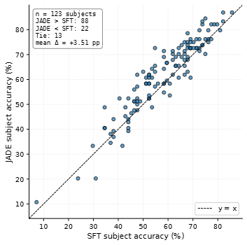
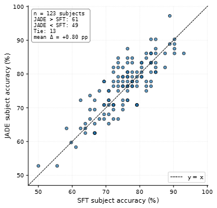
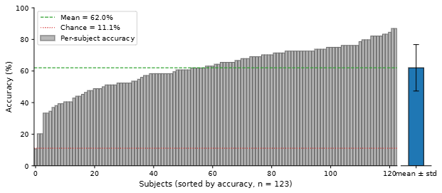
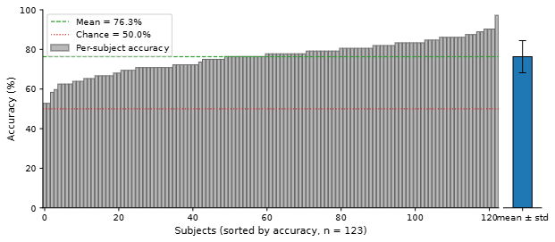
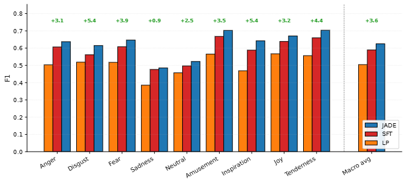
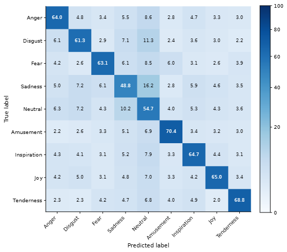

<div align="center">
  <h1>🧠 JADE: Joint Alignment & Discriminative Embedding</h1>
  <p><i>A new SOTA for cross-subject EEG emotion recognition — fine-tuning a pretrained EEG foundation model with a supervised contrastive objective to generalize to unseen people with zero calibration.</i></p>

  <p>
    
    
    
    
    
    
    
  </p>

</div>

---

## 🚀 Overview

*Master Thesis in Computer Science at [TU Delft](https://www.tudelft.nl/en/), conducted at [Zander Labs](https://zanderlabs.com/).*

Decoding human emotions from EEG data is notoriously difficult because every brain is unique. Traditional models often fail when tested on new individuals without requiring extensive, time-consuming recalibration. 

**JADE** (Joint Alignment & Discriminative Embedding) is built to solve this **cross-subject generalization** bottleneck: we take [REVE](https://brain-bzh.github.io/reve/), a massive pretrained EEG foundation model, and fine-tune it using a **Supervised Contrastive (SupCon)** objective. By explicitly forcing the model to group similar emotional states together, regardless of whose brain generated them, JADE achieves zero-calibration generalization on completely unseen subjects.

---

## 🔬 The Research Questions

This work systematically breaks down the generalization problem by answering two pivotal questions:

*   **RQ1: The Foundation Baseline:** Are the frozen embeddings from a large pretrained EEG foundation model naturally robust enough to overcome inter-subject variability on their own?
*   **RQ2: The SupCon Advantage:** Does fine-tuning that foundation model with a supervised contrastive objective (JADE) push generalization boundaries further than standard fine-tuning and state-of-the-art cross-subject frameworks?

---

## 🎯 Methodology & Scope

To rigorously test our hypotheses, we implemented and compared three training strategies under strict **10-fold cross-subject cross-validation** on the FACED dataset (123 subjects, 28 video stimuli, 9 emotion categories):

1.  **Linear Probing (LP):** Leaves the REVE foundation model completely frozen and trains a single linear classifier on top. This establishes the absolute lower bound of what frozen embeddings can achieve (Answers RQ1).
2.  **Supervised Fine-Tuning (SFT):** A two-stage baseline. It starts with an LP warmup, followed by a full encoder fine-tune using standard cross-entropy. This isolates the specific contribution of our alignment strategy.
3.  **JADE (Proposed Method):** Follows the same staged schedule as SFT, but injects a parallel projection head and a Supervised Contrastive term into the loss function during Stage 2. This explicitly aligns the representations across subjects (Answers RQ2).
---

## 📊 Results Summary

Cross-subject classification accuracy on FACED, 10-fold cross-subject protocol (best per task in **bold**):

| Method       | Binary acc (%) | Binary std | Nine-class acc (%) | Nine-class std |
|--------------|---------------:|-----------:|-------------------:|---------------:|
| DE+SVM       |          69.50 |      16.00 |              34.90 |          10.70 |
| DE+MLP       |          70.20 |      11.20 |              35.10 |          10.30 |
| DANN         |          50.50 |       7.10 |              54.10 |           8.30 |
| CLISA        |          70.10 |      15.80 |              41.30 |          12.70 |
| CL-CS        |          72.50 |      15.30 |              43.40 |          13.70 |
| DAEST        |          75.40 |       5.50 |              59.30 |           7.70 |
| **LP**       |          71.64 |       9.29 |              50.27 |          13.69 |
| **SFT**      |          75.52 |       7.76 |              58.52 |          14.01 |
| **JADE**     |       **76.32** |    **8.12** |          **62.03** |      **14.70** |


**What this says.**

- **LP already beats CL-CS** (the prior SOTA contrastive cross-subject framework) on 9-class by **+6.87 pp**, and matches it on binary — *without exposing any part of the encoder to FACED during training*. Subject-invariance can be inherited from large-scale pretraining, not learned from one small dataset.
- **LP → SFT → JADE is monotone** on both tasks. On 9-class JADE adds **+3.51 pp over SFT** (Wilcoxon Holm-adjusted *p* = 4.4e−10; 95 % bootstrap CI on the paired mean Δ: [+2.60, +4.44] pp). On binary the same recipe adds **+0.80 pp** and does not reach significance under multiple-comparison correction (*p* = 0.080) — the task is too coarse for label-aware contrastive alignment to help much.
- **JADE establishes a new SOTA on FACED**: +3.82 pp over CL-CS on binary and +18.63 pp on 9-class. Out of 123 held-out subjects, 0 fall below chance on binary and only 1 falls below chance on 9-class — generalization is essentially uniform across the cohort.

### 🎬 Stimulus-generalization — what the model actually learned

We also held out whole video clips, not just subjects, to test whether the model learned emotion or just clip identity.

| Method | Binary acc (%) | 9-class acc (%) |
|---|---:|---:|
| LP | 58.46 | 15.83 |
| SFT | 59.86 | 15.27 |
| **JADE** | **59.55** | **15.88** |
| *chance* | *50.00* | *11.11* |

On **9-class, accuracy collapses to almost chance** (~16 % vs 11 %), all three methods together. Under the standard protocol the same clips are shown to train and test subjects, so a clip-specific signal already scores well; removing the shortcut reveals that most of what looked like emotion recognition was clip recognition. SupCon cannot fix this: with only ~3 clips per emotion (~2 after hold-out), there is no cross-clip variation for the loss to abstract over — and the collapse hits LP too, so the bottleneck is the dataset, not the loss. **Binary survives** (~59 %) because each label spans four emotions and many more clips, averaging out the clip-specific signal.

This is the main limitation of the work and motivates a larger, clip-diverse benchmark.

### Subject-wise & Per-Class behaviour
JADE outperforms SFT on 88/123 subjects on 9-class (mean Δ = +3.51 pp, broad-based across the cohort) and on 61/123 subjects on binary (mean Δ = +0.80 pp, essentially interchangeable). 

#### JADE vs SFT: Paired Subject Scatter (Left: 9-Class, Right: Binary)
<p align="center">
  
  &nbsp; &nbsp; &nbsp;
  
</p>

#### Per-subject accuracy under JADE (Left: 9-Class, Right: Binary)
<p align="center">
  
  &nbsp; &nbsp; &nbsp;
  
</p>

#### Per-Class F1 Scores (9-Class Only)
<p align="center">
  
</p>

#### Confusion Matrix (9-Class Only)
<p align="center">
  
</p>

Full paired significance tests (Wilcoxon + BCa + Holm) and per-class breakdowns can be found in [`docs/results_brief.md`](docs/results_brief.md) and [`docs/statistical_tests.md`](docs/statistical_tests.md).

---

## 🚀 Getting Started

### 1️⃣ Prerequisites

* **Python Package Manager:** We use `uv` for lightning-fast dependency management. [Install uv here](https://docs.astral.sh/uv/getting-started/installation/).
* **Dataset:** Download the raw FACED data:
  * **FACED Dataset:** [Paper Link](https://doi.org/10.1038/s41597-023-02650-w) | [Download Link](https://doi.org/10.7303/syn50614194)

Place the downloaded data in `data/FACED/`.

### 2️⃣ Installation & Setup

Sync the environment using `uv`:

```bash
uv sync
```

### 3️⃣ Download Pre-Trained Models

Download the pre-trained REVE base model and position embeddings directly from Hugging Face (requires having access to REVE and an Access token):

```bash
uv run python -m src.download_reve.download_models
```

### 4️⃣ Data Preprocessing

Preprocess the raw FACED files (`.pkl` → `.npy`, FFT-based resampling 250 → 200 Hz, channel standardisation):

```bash
uv run python -m src.preprocessing.faced.run_preprocessing
```

*(Tip: append `--validate` to verify the output shapes and types.)*

---

## 🏋️‍♂️ Training Pipelines

*Note: Always use `uv run python` to ensure you are executing within the correct isolated environment.*

### 🔍 Linear Probing (LP)

Train the linear classification head while keeping the REVE encoder frozen.

```bash
# 9-class, all folds
uv run python -m src.approaches.linear_probing.train_lp --dataset faced --task 9-class

# Binary, single fold
uv run python -m src.approaches.linear_probing.train_lp --dataset faced --task binary --fold 1

# Custom window/stride (default: 10 s window, 10 s stride)
uv run python -m src.approaches.linear_probing.train_lp --dataset faced --task binary --window 6 --stride 6
```

### 🎛️ Supervised Fine-Tuning (SFT)

Two-stage pipeline: LP warmup (frozen encoder, trains query token + head), then encoder fine-tuning. LoRA by default; pass `--fullft` for full fine-tuning.

```bash
# LoRA fine-tuning, 9-class, all folds
uv run python -m src.approaches.fine_tuning.train_ft --dataset faced --task 9-class

# Full fine-tuning (no LoRA)
uv run python -m src.approaches.fine_tuning.train_ft --dataset faced --fullft

# Custom LoRA rank
uv run python -m src.approaches.fine_tuning.train_ft --dataset faced --lora-rank 8
```

### 🧬 JADE (Joint Alignment and Discriminative Embedding)

Same two-stage schedule as SFT, but Stage 2 adds a SupCon term to the loss via a parallel projection head.

```bash
# JADE 9-class, full FT, winning HPs (Wilcoxon Holm-adjusted p = 4.4e-10 vs SFT)
uv run python -m src.approaches.jade.train_jade \
    --dataset faced --task 9-class --fullft \
    --alpha 0.3 --temperature 0.2 \
    --batch-size 256 --ft-lr 4e-4

# JADE binary, full FT, winning HPs
uv run python -m src.approaches.jade.train_jade \
    --dataset faced --task binary --fullft \
    --alpha 0.2 --temperature 0.05 \
    --batch-size 128 --ft-lr 1e-4

# Smoke test: one fold, tiny epochs (~5 min on A100)
uv run python -m src.approaches.jade.train_jade \
    --dataset faced --task 9-class --fullft \
    --fold 1 --lp-epochs 2 --ft-epochs 3 \
    --alpha 0.3 --temperature 0.2 --batch-size 256 --ft-lr 4e-4
```

---

## 📂 Project Structure

```text
jade-mscthesis/
├── configs/                # YAML configs (sampling, channel layouts, etc.)
├── data/                   # Raw + preprocessed FACED
├── models/                 # Downloaded REVE weights and position embeddings
├── outputs/                # Per-fold checkpoints (gitignored)
├── main-results/           # Canonical per-run JSON+NPZ artifacts (one per winning config)
├── src/
│   ├── approaches/         # Training algorithms
│   │   ├── shared/         # Shared utilities (config, dataset, metrics, optimizer, REVE loader)
│   │   ├── linear_probing/ # LP — frozen encoder + linear head
│   │   ├── fine_tuning/    # SFT — LP warmup + full FT (or LoRA)
│   │   └── jade/           # JADE — SFT + joint CE+SupCon
│   ├── datasets/           # FACED window dataset + k-fold splits
│   ├── preprocessing/      # Raw EEG → .npy tensors
│   ├── inference/          # Post-hoc inference, statistical tests, seed averaging
│   ├── visualization/      # All figure-generation scripts + per-task figure folders
│   ├── exploration/        # One-off data exploration scripts
│   └── download_reve/      # HF download for REVE weights
├── slurm/                  # Every sbatch script used to produce the results
├── docs/                   # Findings, methodology, statistical tests — see docs/README.md
└── tests/                  # Fast unit tests (no model, no real data)
```

---

## 📚 Documentation

The `docs/` folder is the source of truth for everything beyond this README:

- [`docs/results_brief.md`](docs/results_brief.md) — detailed results: headline accuracies, per-class metrics, confusion matrices, subject-wise breakdowns
- [`docs/statistical_tests.md`](docs/statistical_tests.md) — paired Wilcoxon + BCa CIs + Holm on main results (auto-generated)
- [`docs/statistical_tests_generalization.md`](docs/statistical_tests_generalization.md) — Friedman + Brown-Forsythe on stimulus-generalization (auto-generated)
- [`docs/jade_approach_design.md`](docs/jade_approach_design.md) — JADE design rationale (loss, projection head, schedule)
- [`docs/jade_hp_sweep.md`](docs/jade_hp_sweep.md) — staged HP tuning protocol, sweep tables, and selected per-task configurations
- [`docs/runs_inventory.md`](docs/runs_inventory.md) — inventory of every run + which sweep cell it belongs to

---

## 📝 Citation

```bibtex
@mastersthesis{pasinato2026jade,
  author = {Alberto Pasinato},
  title  = {Supervised Contrastive Fine-Tuning of EEG Foundation Models for Cross-Subject Emotion Recognition},
  school = {Delft University of Technology},
  year   = {2026},
  type   = {MSc thesis, Computer Science},
  note   = {External project conducted at Zander Labs},
  url    = {http://repository.tudelft.nl/}
}
```

**Contact:** Alberto Pasinato — A.Pasinato@student.tudelft.nl
